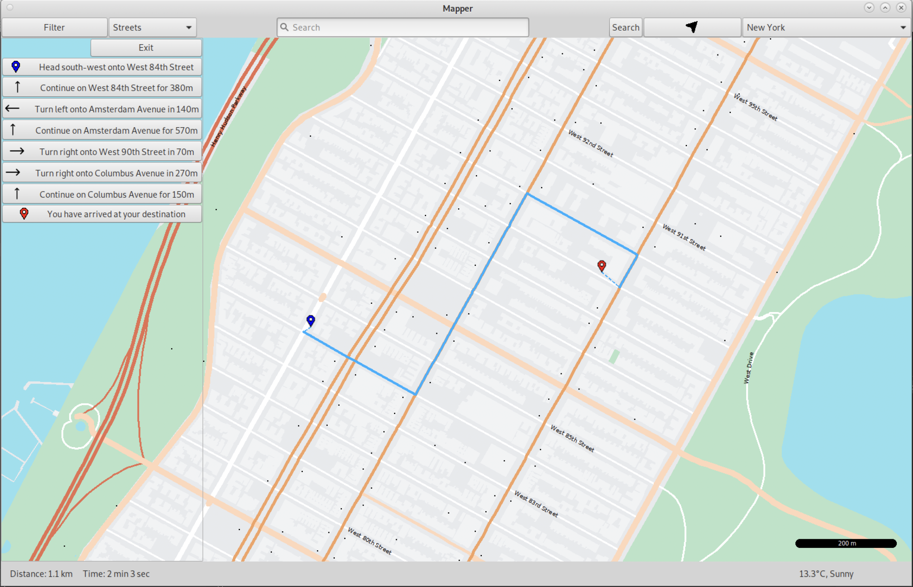

# Geographic Information System (GIS)

Written using C++ with the EZGL library, GTK library and OpenStreetMap(OSM) database API. CSS was used for better graphical design. Users are able to pan around using the mouse or arrow keys and zoom in/out using the buttons on the bottom right corner. The user can click the i button on the bottom right to get more general help.

Features
==============
Subway lines
------------
Subway data such as the location, color and lines were extracted from the OSM database. Subway stations are accurate in location and subway line colors match the current city's representation.

Night mode
----------
Night mode is used for users who want a dark background while maintaing contrast ratios. The background color as well as street, building and land feature colors are inverted for visual comfort.

Icons
-----
By zooming further in the map displays icons in its accurate location. Currently the map contains 20+ unique icons that can be differentiated easily. To help with the latency between panning around the map, only at a certain zoom level the icons can be viewed. Clicking on these icons give further detailed information such as opening hours, phone numbers, etc. These information was found using the OSM database.

Searching
---------
The user can search for streets, intersections, features and point of interests. When a search has multiple results, the results are shown on the left. When a result is clicked, the location is zoomed in for easier navigation. Additionally, the user can filter searches, such as restaurants, cafes, etc. This helps with more accurate search results.

Auto complete
-------------
To help the user with a better searching experience, auto complete is enabled to the search bar. The auto complete results change when the user decides to search in a different city. Auto complete is available in multiple langauges such as English, Chinese, Japanese, Spanish, French and Arabic.

Directions
----------
The user can click on the map to place the starting location and then click once again to pinpoint the destination. Furthermore, directions can be highlighted when the cursor is hovering over the direction.

The user can also search for the source and destination either by searching the intersection of two streets or the address of the location. If multiple results are found the user can choose from given results.

Weather
-------
Using the C++ Libcurl API, accurate and current weather information is displayed on the bottom right corner. Both the temperature and the weather condition is shown.

Distance Scale
--------------
To help the user with a better sense of distance, a distance scale shown in the bottom right corner.

Algorithms
==========
Searching Algorithm
-------------------
Levenshtein's distance algorithm was used for fuzzy search. When a user searches for a location that has no exact match, Levenshtein's algorithm helps find an approximate match to the result. A distance value of +1 is added when the search result can match the actual data by inserting, deleting or changing the current letter.

Dijkstra's Algorithm with Heuristics (A* Algorithm)
---------------------------------------------------
Algorithm used to find a path with the shortest travel time. One additional feature is that the algorithm takes into account of left and right turns on streets for approximating traffic lights. Additionally, a heuristics was added to enhance the search time of the algorithm. This heuristics was calculated by dividing the maximum speed with the distance between the current and destination nodes. This was then added to the time taken to travel a street. This new travel time was then used to find the shortest path between two locations.

Multi-destination Dijkstra's Algorithm
--------------------------------------
Given one source and multiple destinations, the user can find the shortest path between the source and each destination. This algorithm is useful when finding the solution for the travelling courier problem. Even though there are multiple destinations, this algorithm has the same time complexity as Dijkstra's algorithm with only one destination.

Travelling Courier Problem
--------------------------
This was a variation of the travelling salesman problem. If the user wants to deliver a package around the city, the user must pickup the packages and then drop them off only if the package was already picked up. Since this problem is an NP problem, only an approximate answer is possible. The path to the shortest time taken to pick up and drop off all packages were calculated using the multi-destination Dijkstra's algorithm discussed above. After finding a path, the 2-opt algorithm was applied to randomly switch around the delivery locations such that the path time decreases. To optimize the search time, multithreading was used to separate the tasks into different threads.
